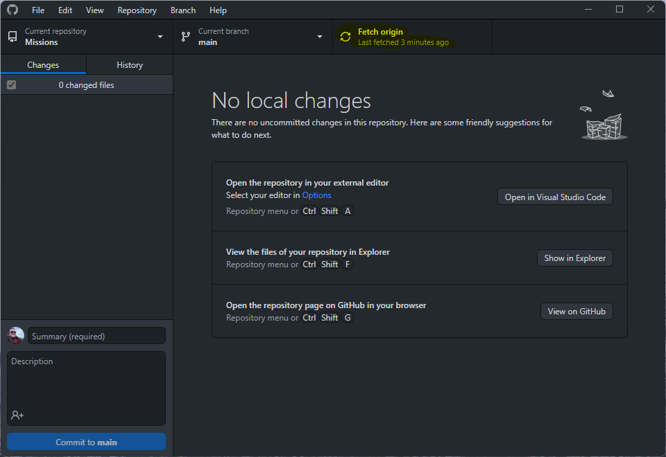
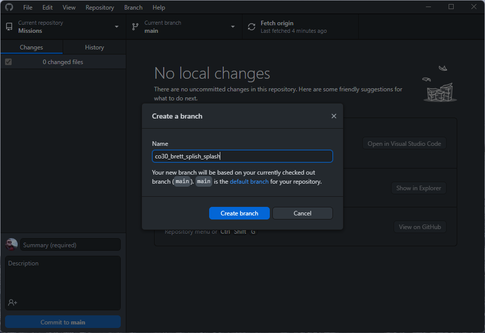
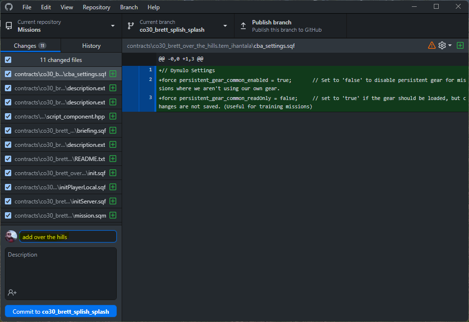

# Synixe Contractors - Missions

## First Time Setup

1. Download and install [GitHub Desktop](https://desktop.github.com/)
2. Sign in or create a GitHub account
3. Request access to the Synixe Contractors organization, if you are not already a member
4. Clone the repository
    - `Clone a repository from the Internet...`
    - Select `SynixeContractors/missions`
    - Select Directory
        - Select `Choose` under local path
        - Navigate to your Arma 3 mpmissions folder in my documents
        - Create a new folder `Synixe`
        - `Select Folder`
    - `Clone`

## Create a new mission

1. Open GitHub Desktop
2. Click `Current Repository` and select `SynixeContractors/missions`
3. Click `Branch` and select `main`
4. Click `Fetch origin`

5. Click `Pull origin` if available (Same button as `Fetch origin`)
6. Click `Current Branch` and select `New branch`
7. Name the branch `<type>_<author>_<name>`
    - Example: `co30_brett_over_the_hills`
    - Example: `tco30_matías_welcome_to_the_jungle`
    - Example: `spc_arsey_spies`

8. Open Arma and create a new missions
9. Save the mission under `MPMissions/Synixe/Missions/contracts` (or another folder if you are not creating a contract), **uncheck `Binarize the Sceario File`**
10. Create and test the mission
11. Return to GitHub Desktop, you will see the new mission file in the `Changes` tab

12. Commit the mission
    - Enter a commit message
    - Click `Commit to <branch name>`
    - Click `Publish branch`
    - Click `Create Pull Request`
    - Fill in any details on the website that opens
    - Click `Create pull request`
13. In GitHub desktop, click `Current Branch` and select `main` after your mission has been merged
